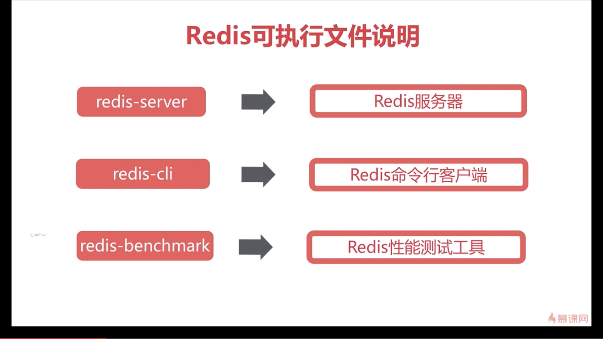
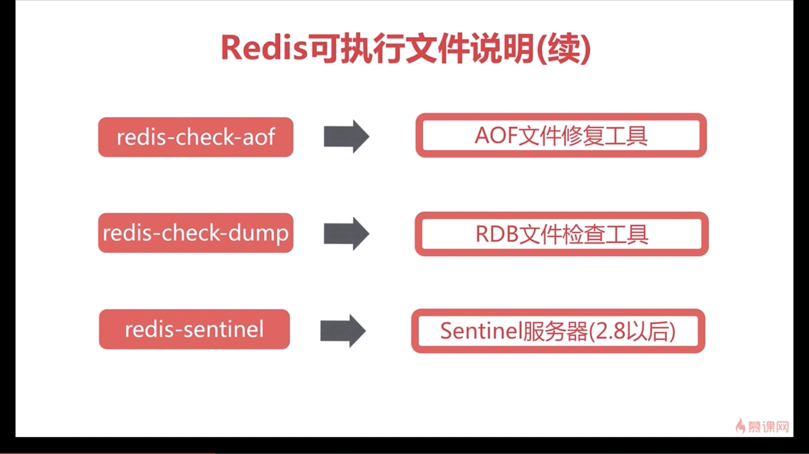
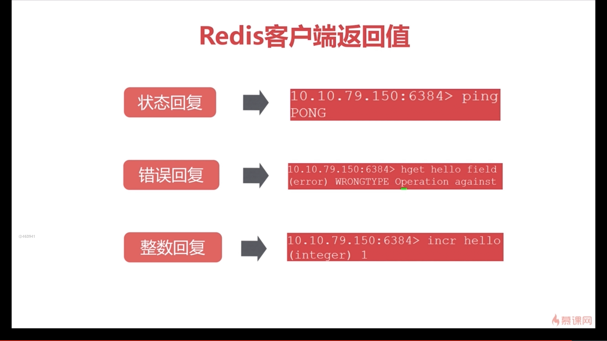
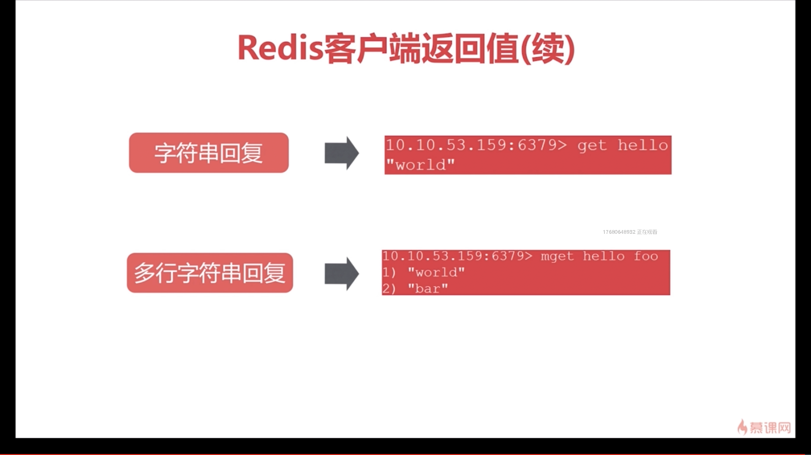

# 1-14 redis三种启动方式介绍

|本期版本|上期版本
|:---:|:---:
`Wed Sep 28 23:54:38 CST 2022` | -

**三种启动方式**

* 默认参数、动态参数、配置文件

**三种启动方式比较**

* 生产环境选择配置启动
* 单机多实例配置文件可以用端口区分开

**验证**

* 进程: `ps -ef | grep redis`
* 端口: `sudo netstat -antpl | grep redis`
* 功能: `redis-cli -h ip -p port ping`

