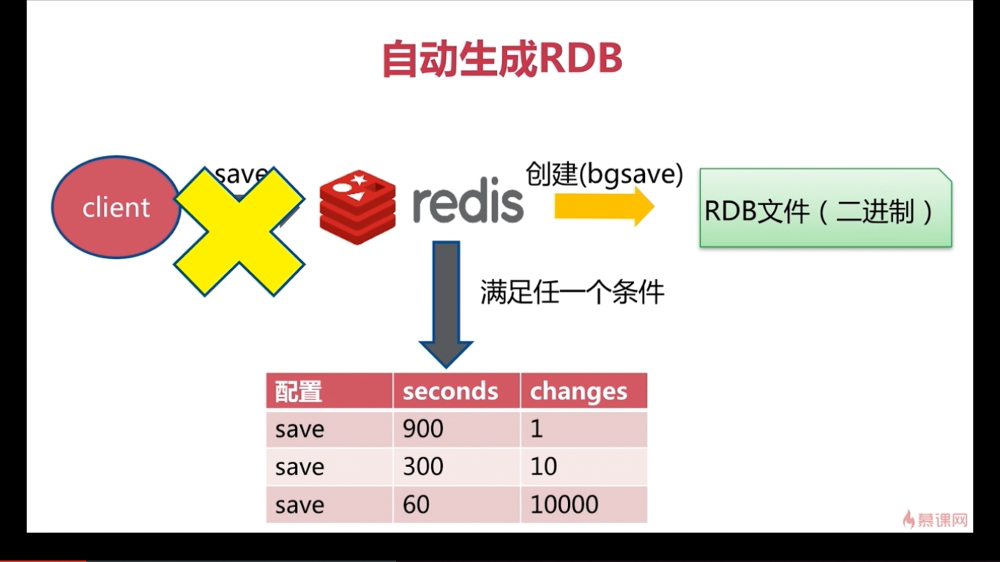

# 5-4 RDB(2)

|本期版本|上期版本
|:---:|:---:
`Fri Sep 30 11:41:45 CST 2022` | -

## 配置

名称|说明
---|----
`dbfilename` | 文件名称: `dump-${port}.rdb`
`stop-writes-on-bgsave-error` | 发生错误是否停止: `yes`
`rdbcompression` | 采用压缩格式: `yes`
`rdbchecksum` | 校验: `yes`

## 实验

* `info memory`
* `ps -ef| grep redis- | grep -v 'redis-cli' | grep -v 'grep'` - `redis-rdb-bgsave`